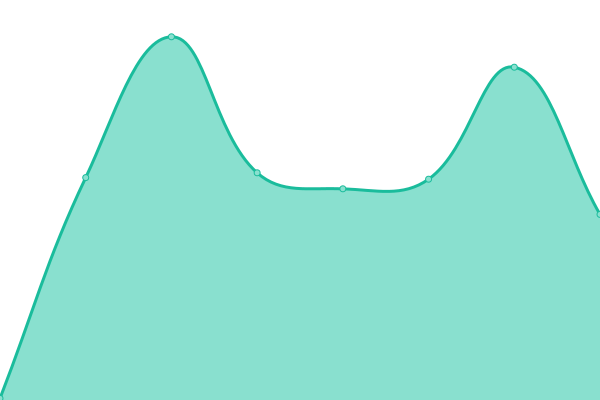
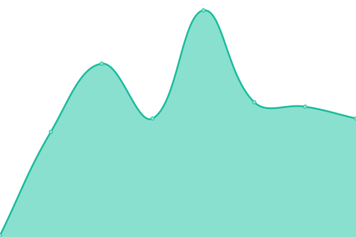
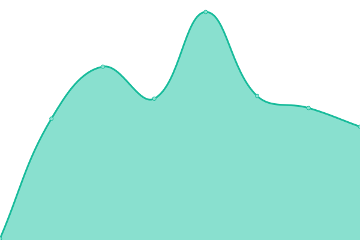
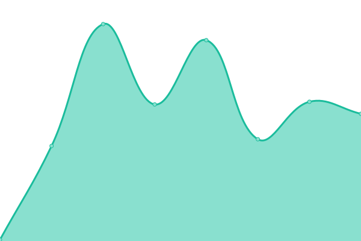

# [📈 Live Status](https://CryptoNovaX.github.io/web-status): <!--live status--> **🟩 All systems operational**

This repository contains the open-source uptime monitor and status page for [CryptoNovaX Asset Management](https://www.cryptonvx.com/), powered by [Upptime](https://github.com/upptime/upptime).

With [Upptime](https://upptime.js.org), you can get your own unlimited and free uptime monitor and status page, powered entirely by a GitHub repository. We use [Issues](https://github.com/CryptoNovaX/web-status/issues) as incident reports, [Actions](https://github.com/CryptoNovaX/web-status/actions) as uptime monitors, and [Pages](https://CryptoNovaX.github.io/web-status) for the status page.

<!--start: status pages-->
<!-- This summary is generated by Upptime (https://github.com/upptime/upptime) -->
<!-- Do not edit this manually, your changes will be overwritten -->
<!-- prettier-ignore -->
| URL | Status | History | Response Time | Uptime |
| --- | ------ | ------- | ------------- | ------ |
|  [Front-end | Site principal](https://www.cryptonvx.com/up.txt) | 🟩 Up | [front-end-site-principal.yml](https://github.com/CryptoNovaX/web-status/commits/HEAD/history/front-end-site-principal.yml) | 

 176ms
     
 | 

<a href="https://status.cryptonvx.com/history/front-end-site-principal">100.00%</a>
    

|  [Front-end | Plateforme](https://app.cryptonvx.com/up.txt) | 🟩 Up | [front-end-plateforme.yml](https://github.com/CryptoNovaX/web-status/commits/HEAD/history/front-end-plateforme.yml) | 

 209ms
     
 | 

<a href="https://status.cryptonvx.com/history/front-end-plateforme">100.00%</a>
    

|  [API | Connexion / Inscription](https://login-api.login-api.workers.dev/up) | 🟩 Up | [api-connexion-inscription.yml](https://github.com/CryptoNovaX/web-status/commits/HEAD/history/api-connexion-inscription.yml) | 

 165ms
     
 | 

<a href="https://status.cryptonvx.com/history/api-connexion-inscription">100.00%</a>
    

|  [API | Profil de l'utilisateur](https://api.cryptonvx.com/up) | 🟩 Up | [api-profil-de-l-utilisateur.yml](https://github.com/CryptoNovaX/web-status/commits/HEAD/history/api-profil-de-l-utilisateur.yml) | 

 169ms
     
 | 

<a href="https://status.cryptonvx.com/history/api-profil-de-l-utilisateur">100.00%</a>
    

|  [API | Mise à jour des prix](https://price-cryptonvx.mongo-price-storage.workers.dev/up) | 🟩 Up | [api-mise-a-jour-des-prix.yml](https://github.com/CryptoNovaX/web-status/commits/HEAD/history/api-mise-a-jour-des-prix.yml) | 

 113ms
     
 | 

<a href="https://status.cryptonvx.com/history/api-mise-a-jour-des-prix">100.00%</a>
    

|  [API | Historique des prix](https://candles-cryptonvx.candles-api.workers.dev/up) | 🟩 Up | [api-historique-des-prix.yml](https://github.com/CryptoNovaX/web-status/commits/HEAD/history/api-historique-des-prix.yml) | 

 128ms
     
 | 

<a href="https://status.cryptonvx.com/history/api-historique-des-prix">100.00%</a>
    

|  [API | Newsletter](https://newsletter-api.newsletter-658.workers.dev/up) | 🟩 Up | [api-newsletter.yml](https://github.com/CryptoNovaX/web-status/commits/HEAD/history/api-newsletter.yml) | 

 197ms
     
 | 

<a href="https://status.cryptonvx.com/history/api-newsletter">100.00%</a>
    

|  [API | Taux de change fiat](https://currency-cryptonvx.currency-api.workers.dev/up) | 🟩 Up | [api-taux-de-change-fiat.yml](https://github.com/CryptoNovaX/web-status/commits/HEAD/history/api-taux-de-change-fiat.yml) | 

 168ms
     
 | 

<a href="https://status.cryptonvx.com/history/api-taux-de-change-fiat">100.00%</a>
    

|  [CDN | Content Delivery Network](https://cdn.cryptonvx.com/up.txt) | 🟩 Up | [cdn-content-delivery-network.yml](https://github.com/CryptoNovaX/web-status/commits/HEAD/history/cdn-content-delivery-network.yml) | 

 192ms
     
 | 

<a href="https://status.cryptonvx.com/history/cdn-content-delivery-network">100.00%</a>
    

|  [Ressource | Blog et actualités](https://www.cryptonvx.com/blog/up.txt) | 🟩 Up | [ressource-blog-et-actualites.yml](https://github.com/CryptoNovaX/web-status/commits/HEAD/history/ressource-blog-et-actualites.yml) | 

 99ms
     
 | 

<a href="https://status.cryptonvx.com/history/ressource-blog-et-actualites">100.00%</a>
    

<!--end: status pages-->

[**Visit our status website →**](https://CryptoNovaX.github.io/web-status)

## 📄 License

- Powered by: [Upptime](https://github.com/upptime/upptime)
- Code: [MIT](./LICENSE) © [Anand Chowdhary](https://anandchowdhary.com), supported by [Pabio](https://pabio.com)
- Data in the `./history` directory: [Open Database License](https://opendatacommons.org/licenses/odbl/1-0/)
